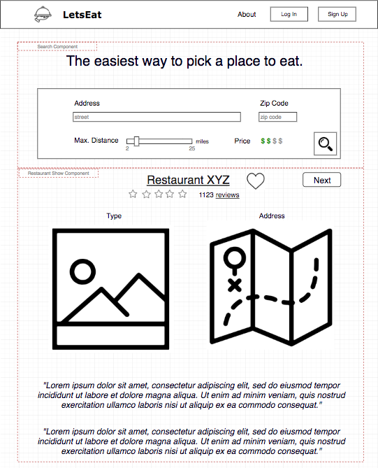
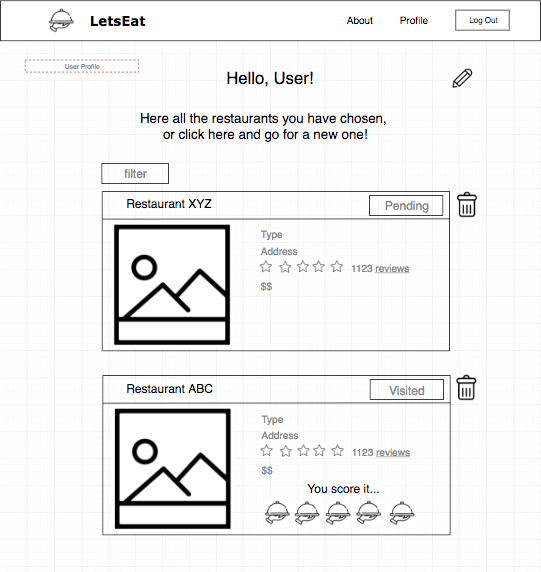

# README Flex Proposal

## Background and Overview
LetsEat is a site that will randomly choose a restaurant for the user. The user will fill out info (distance, and maybe price range) and a randomly generated restaurant will appear, a sort of Tinder like app but for restaurants.

## Functionality & MVP List
* User Auth
  * sign up, login, logout
* Search
    * Fill in location, and price range
    * No need to have an account to search
* Restaurant show
    * Display restaurant info(name, address, phone num, price range, rating, one pic)
    * Display restaurant top reviews
    * User can like/bookmar (if logged in)
    * Show restaurant location on google map
* User Show
    * Display user name, profile img
    * Display user's like/bookmarked restaurants
    * User's can update profile
    * User's can delete liked/bookmarked restaurants

## Wireframes
A front page wireframe, with the search result on the bottom. Users will be able to get a random restaurant depending on the input fields, restaurant will then show up, with reviews and the address along with the type of food

The users show page will display the restaurants the user has liked. There will be a button indicating whether they have visited the restaurant or not and on this page the user will be able to delete from liked

## Architecture & Technologies
* Frontend: JavaScript
* Backend: MERN
* Yelp API
* GoogleMap API

### Backend:
* Will need to acces Yelp API in order to access restaurant info.
* User auth

### Frontend:
* GoogleMap will appear with restaurant info. (GoogleMap API)
* Functionality for user to like

### Specs

#### Colors
* Text and icons:
    * Dark Grey: #2F2F2F
    * White: #FFFFFF
    * Grey: #666666
    * Light Grey: #CCCCCC

* WebPage
    * Blue: #A1C3D1
    * Purple: #B39BC8
    * Very Light Purple: #F0EBF4
    * Yellow: #FBE8A6
    * Pink: #F172A1
    * Lighter Pink: #E64398

#### Font and Sizes
* Font: Open Sans
* Weight: 400
* Line Height: 1.5
* Sizes: 
    * Heading:  20px
    * Title: 18px
    * Subtitle: 16 px
    * Body: 14px

## Group Members & Work Breakdwon
Natasha Wei, Nataly Menares, Jose Martinez

Nataly's Responsibilities
* Design
* Auth form
* Search functionality
* User profile

Jose's Responsibilities
* User Auth
* Like/Bookmark
* README

Natasha's Responsibilities
* Backend setup
* API intergation
* Restaurant Show

Over the weekend: Work on user auth 
* Finish tutorial of MERN Stack - All members
* Backend setup - Natasha (we can then pull from git when setup)
* Work on user auth - Jose
* Design and Specs - Nataly

Day 1 and 2
* Finish user auth - Jose
    * Also, user can edit their profile.
* Start creating user-restaurant relation - Jose
* Integrate Backend with Frontend React-Redux - All
* Integrate Yelp API - Natasha
* Work on auth form - Nataly

Day 2 and 3
* Work on Biz show - Natasha 
* Work on Search - Nataly
* Like/Bookmark - Jose
    * Create and destroy user-biz relation.

Day 3 and 4
* Work on user profile - Nataly
* Heroku setup - Jose
* Clean up bugs at this point to ensure smooth navigation - All members
* GoogleMap API - Natasha

Day 5
* README - Jose
* Style and polish - Natasha and Nataly
