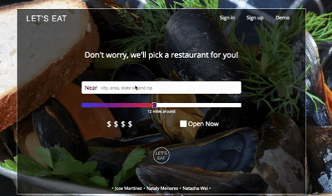
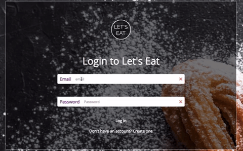

# README

Try our site on [Demo](https://let-us-eat.herokuapp.com/#/)

## About
Ever crave different food but don't know which restaurant to pick? Maybe you are sick of your usual places and want to try something new? Let's Eat was built to make the decision for you. Just input your location, enter a price range and the mile radius from your location and BOOM! A randomly generated restaurant chosen for you!

## Technology used
* Node.js
* JavaScript
* MongoDB
* mLab
* HTML and CSS

## Features
* ### Search


Users can enter a city, zip, or area and specify the radius near that area. They can enter the price range and if the restaurant is open at the time. The code snippet below explains the styling done for the loading icon. Done by Nataly Menares.
```javascript
if (!this.props.currentRes.hours || this.props.resIds.length === 0){
    return ;
};
```

```scss
@keyframes load8 {
  0% {
    transform: rotate(0deg);
  }
  50% {
    transform: rotate(180deg);
  }
  100% {
    transform: rotate(360deg);
  }
}

.loader:empty {
  margin: 30px;
  height: 50px;
  width: 50px;
  border: 10px solid #6c4bba ;
  border-left: 10px solid rgba(0,0,0, 0.1);
  border-radius: 50%;
  animation: load8 1.5s infinite linear;
}
```
* ### Restaurant Show Page

A Random restaurant will generate upon search, here the user can get info for that restaurant. And images generated by Yelp API. After if a user is logged in, a user can like the restaurant to keep that information.


* ### User Profile


Users who create their own profile can access the restaurants they have saved in their "likes". If a user no longer "likes" the restaurant or if they visited the restaurant and no longer need to keep the information they can remove from their likes.

Here is the code snippet in order to populate the user's profile. Taking advantage of React's life-cycle, before `componentDidMount`, a call is made to  `/current` to get the current user and then use the `.populate` method to get the liked restaurants of that user and get back a single array. With the `.populate` method we only call once, rather than one call per restaurant! Done by Natasha Wei

```javascript
router.get(
  "/current",
  passport.authenticate("jwt", { session: false }),
  (req, res) => {
      User.findOne({email: req.user.email})
        .populate('likedResIds')
        .exec(function(err, user) {
            
            const payload = {
                id: user.id,
                email: user.email,
                ....
            }
            jsonwebtoken.sign(
                payload,
                keys.secretOrKey,
                // Key will expire in one hour
                { expiresIn: 3600 },
                (err, token) => {
                    res.json({
                        success: true,
                        token: 'Bearer ' + token,
                        user
                    });
                });
            
      })
      
  }
);
```
* ### Session



Users can sign up or sign in. If a user inputs an incorrect email, or does not follow the password pattern stated they will not be able to sign in or create an account.

Taking advantage of HTML5's required, setting one of the attributes for the `input[type='password']` tag was set to ensure users were inputting in the field. Next using the `pattern` attribute and using a little bit of regex, I was able to set 6 character minimum, one lowercase and one uppercase letter. Done by Jose Martinez

```html
    <div className="username">
        <div className="inputs">
            <h2>Password</h2>
            <input type="password" id="password" className="inputs-sess-form" required onChange={this.update("password")} value={this.state.password} placeholder="Password" pattern="(?=.*\d)(?=.*[a-z])(?=.*[A-Z]).{6,}"/>
            <div className="pass-requirements" style={this.props.formType === "signup" ? {color: "30%"} : {bottom: "24%"}}>
                    6 characters, one number, one lowercase and uppercase letter
            </div>
        </div>
    </div>
```

